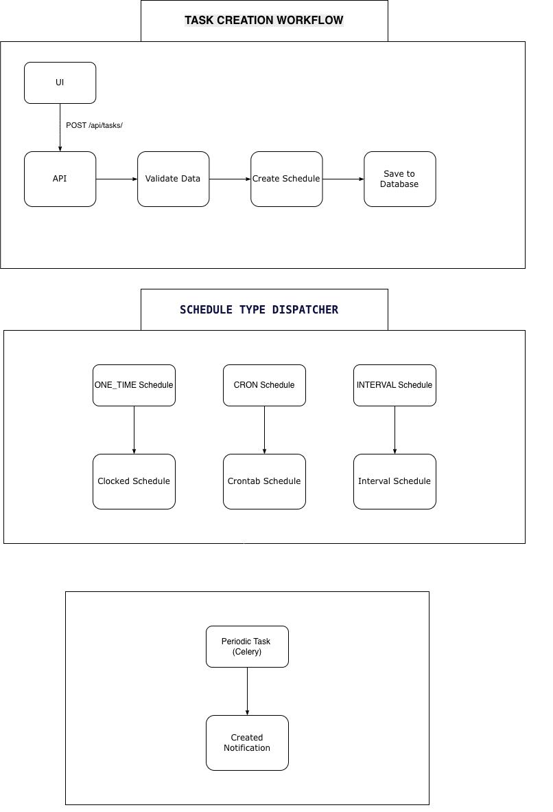

# Scheduled Task & Notification Engine

A task scheduling and notification system built with Django REST Framework, Celery Beat, Redis, and React.

Users can create one-time or recurring tasks. Tasks execute in the background and generate notifications visible in the UI.

# Overview

This system allows users to:

Schedule one-time tasks

Schedule recurring tasks (Cron or Interval)

View execution logs

Receive real-time notifications

Automatically recover from missed executions

The system is designed to behave like a production-ready scheduler.

# Scheduling Mechanism

The system uses Celery Beat with django-celery-beat (database-backed scheduler).

Supported Schedule Types

ONE_TIME	     Runs once at a specific datetime

CRON	         Runs based on cron expression

INTERVAL	     Runs every N seconds

# How Scheduling Works

1. Task Creation

User creates a task via React or API:

```
POST /api/tasks/
```
Django:

Validates input

Saves ScheduledTask

Creates corresponding Celery schedule

Registers a PeriodicTask

2. Celery Beat

Reads PeriodicTask records from DB

Checks which tasks are due

Sends due tasks to Redis

3. Celery Worker

Consumes task from Redis

Executes execute_scheduled_task

Logs execution result

Creates notification

# Execution Flow

React UI -> Django API -> Database (ScheduledTask) -> Celery Beat -> Redis (Broker) -> Celery Worker -> ExecutionLog + Notification -> React UI (polls every 5s)

That’s the complete loop.

# Handling Missed or Delayed Executions

Production systems fail. Workers go down. Redis disconnects. Time drifts.

This system includes recovery logic.

1. Recovery Scan (Every 5 Minutes)

A scheduled background task: Detects overdue one-time tasks

Detects stuck recurring tasks

Triggers immediate execution

Creates recovery notifications

Example logic:

```
If scheduled_time <= now
AND not executed
→ trigger immediately
```

2. Retry with Backoff

If a task fails:

Max retries: 3 (configurable)

Delay increases each retry: 60s, 120s, 240s

After max retries → task marked FAILED

This prevents infinite retry loops.

3. Stuck Recurring Tasks

If a recurring task:

Has no next execution

Is still marked ACTIVE

System recreates its periodic schedule automatically.

Self-healing behavior.

# Scheduler → Task → Notification Flow

The Task Creation Flow



The Data Flow Summary


# Setup Instructions

1. Backend Setup
   
Clone repository
```
git clone https://github.com/Hafsusu/scheduled-task-notification-engine.git
cd backend

python -m venv venv
source venv/bin/activate  # On Windows: venv\Scripts\activate

pip install -r requirements.txt

python manage.py migrate

python manage.py createsuperuser
```

2. Redis Setup
```
#macOS
brew install redis
brew services start redis

#Ubuntu/Debian
sudo apt-get install redis-server
sudo systemctl start redis-server

#Windows
choco install redis-64
```

3. Celery Setup
   
Terminal 1 - Start Redis
```
redis-server
```

Terminal 2 - Start Celery Worker
```
cd backend
celery -A backend worker -l info -Q celery,reports
```

Terminal 3 - Start Celery Beat
```
celery -A backend beat -l info --scheduler django_celery_beat.schedulers:DatabaseScheduler
```

Terminal 4 - Start Django
```
python manage.py runserver
```
4. Frontend Setup
```
cd frontend
npm install
npm start
```

# Access the application

Frontend 
```
http://localhost:5173
```

Backend API
```
http://localhost:8000/api
```
